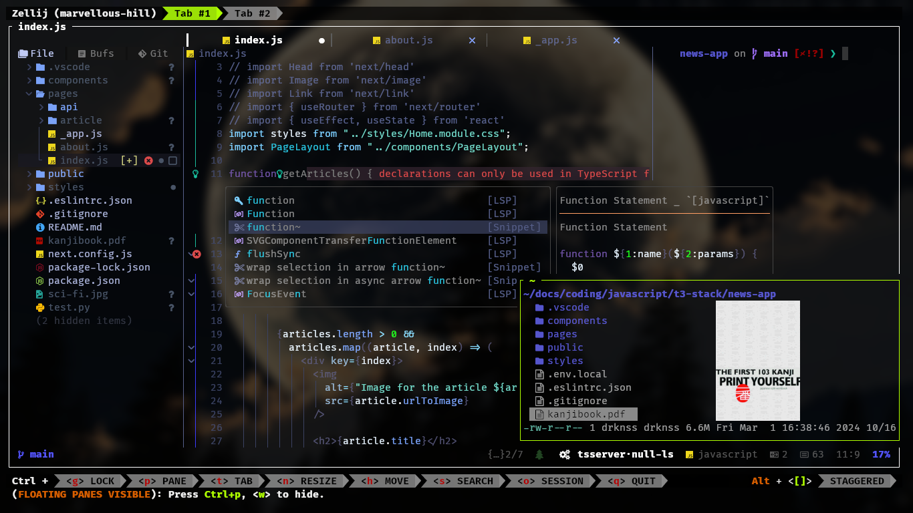

<div align="center">
    
    <p>
        preview/play/open images/videos/pdf/text inside the terminal using
        <a href="https://github.com/gokcehan/lf">lf</a>/
        <a href="https://github.com/mpv-player/mpv">mpv-sixel</a>/
        <a href="https://github.com/neovim/neovim">neovim</a>
    </p>

---

**[<kbd> <br> Install <br> </kbd>][Install]** 
**[<kbd> <br> Wiki <br> </kbd>][Wiki]** 
**[<kbd> <br> Dependencies <br> </kbd>][Dependencies]**

[Install]: #installation
[Wiki]: https://github.com/YeferYV/sixelrice/wiki
[Dependencies]: https://github.com/YeferYV/sixelrice/wiki/dependencies

</div>

---

<details open><summary>Table of Contents</summary>

1. Neovim Text Objects
   - [Neovim text object that starts with a/i](#neovim-text-object-that-starts-with-ai)
   - [Neovim text object that starts with g](#neovim-text-object-that-starts-with-g)
   - [Neovim Motions-Actions](#neovim-motions-actions)
   - [Neovim Space Keymaps](#neovim-space-keymaps)
   - [Neovim Mini.brackets](#neovim-minibrackets)
2. Neovim Goto
   - [Neovim Go to Previous](#neovim-go-to-previous)
   - [Neovim Go to Next](#neovim-go-to-next)
   - [Neovim Go to Previous Start of](#neovim-go-to-previous-start-of)
   - [Neovim Go to Next Start of](#neovim-go-to-next-start-of)
   - [Neovim Go to Previous End of](#neovim-go-to-previous-end-of)
   - [Neovim Go to Next End of](#neovim-go-to-next-end-of)
3. Neovim keymaps.lua
   - [Neovim Neotree File Explorer](#neovim-neotree-file-explorer)
   - [Neovim Suggestion keymaps](#neovim-suggestion-keymaps)
   - [Neovim Editor keymaps](#neovim-editor-keymaps)
   - [Neovim Native ctrl keys](#neovim-native-ctrl-keys)
4. [LF terminal file manager](#lf-terminal-file-manager)
5. [zsh keymaps](#zsh-keymaps)
6. Installation
   - [Dependencies Installation](#dependencies-installation)
   - [Treesitter Installation](#treesitter-installation)
7. [Vim Cheatsheets](#vim-cheatsheets)
8. [Related projects](#related-projects)

</details>

---

## Neovim text object that starts with `a`/`i`

<details><summary></summary>

|          default keymaps           | repeater key | finds and autojumps? | textobject             | description                                                                               | inner / outer                                                                 |
| :--------------------------------: | :----------: | :------------------: | :--------------------- | :---------------------------------------------------------------------------------------- | :---------------------------------------------------------------------------- |
|             `ia`, `aa`             |     `.`      |         yes          | \_function_args        | whole argument/parameter of a function                                                    | outer includes braces                                                         |
|             `iA`, `aA`             |     `.`      |         yes          | @Asignment             | inner: left side of asignment without including type                                      | outer includes left and right side                                            |
|             `ib`, `ab`             |     `.`      |         yes          | \_Braces               | inside of () [] {}                                                                        | outer includes braces                                                         |
|             `iB`, `aB`             |     `.`      |                      | @Block                 | code block (inside of a function, loop, ...)                                              | outer includes line above                                                     |
|             `ic`, `ac`             |     `.`      |                      | word-column            | visual block for words                                                                    | outer includes spaces                                                         |
|             `iC`, `aC`             |     `.`      |                      | WORD-column            | visual block for WORDS                                                                    | outer includes spaces                                                         |
|             `id`, `ad`             |     `.`      |                      | greedyOuterIndentation | outer indentation, expanded to blank lines; useful to get functions with annotations      | outer includes a blank, like `ap`/`ip`                                        |
|             `ie`, `ae`             |     `.`      |                      | nearEoL                | from cursor position to end of line, minus one character                                  | outer includes from start of line (line wise)                                 |
|             `if`, `af`             |     `.`      |         yes          | \_function_call        | like `function args` but only when a function is called                                   | outer includes the function called                                            |
|             `iF`, `aF`             |     `.`      |         yes          | @Function              | inside of a function without leading comments                                             | outer includes function declaration                                           |
|             `ig`, `ag`             |     `.`      |         yes          | @Comment               | line comment                                                                              | outer many times same as inner                                                |
|             `iG`, `aG`             |     `.`      |         yes          | @Conditional           | inside conditional without blanklines                                                     | outer includes the start of a condition                                       |
|             `ih`, `ah`             |     `.`      |         yes          | \_htmlAttribute        | attribute in html/xml like `href="foobar.com"`                                            | inner is only the value inside the quotes trailing comma and space            |
|             `ii`, `ai`             |     `.`      |                      | indentation_noblanks   | surrounding lines with same or higher indentation delimited by blanklines                 | outer includes line above                                                     |
|             `iI`, `aI`             |     `.`      |                      | indentation            | surrounding lines with same or higher indentation                                         | outer includes line above and below                                           |
|             `ij`, `aj`             |     `.`      |         yes          | cssSelector            | class in CSS like `.my-class`                                                             | outer includes trailing comma and space                                       |
|             `ik`, `ak`             |     `.`      |         yes          | \_key                  | key of key-value pair, or left side of a assignment                                       | outer includes spaces                                                         |
|             `il`, `al`             |     `.`      |         yes          | +Last                  | go to last mini.ai text-object (which start with @ or \_)                                 | requires `i`/`a` example `vilk`                                               |
|             `iL`, `aL`             |     `.`      |         yes          | @Loop                  | inside `while` or `for` clauses                                                           | outer includes blankline + comments + line above                              |
|             `im`, `am`             |     `.`      |         yes          | chainMember            | field with the full call, like `.encode(param)`                                           | outer includes the leading `.` (or `:`)                                       |
|             `iM`, `aM`             |     `.`      |         yes          | mdFencedCodeBlock      | markdown fenced code (enclosed by three backticks)                                        | outer includes the enclosing backticks                                        |
|             `in`, `an`             |     `.`      |         yes          | \_number               | numbers, similar to `<C-a>`                                                               | inner: only pure digits, outer: number including minus sign and decimal point |
|             `iN`, `aN`             |     `.`      |         yes          | +Next                  | go to Next mini.ai text-object (which start with @ or \_)                                 | requires `i`/`a` example `viNk`                                               |
|             `io`, `ao`             |     `.`      |         yes          | \_whitespaces          | whitespace beetween characters                                                            | outer includes surroundings                                                   |
|             `ip`, `ap`             |     `.`      |                      | \_paragraph            | blanklines can also be treat as paragraphs when focused on a blankline                    | outer includes below lines                                                    |
|             `iP`, `aP`             |     `.`      |         yes          | @Parameter             | parameters of a function (`>,` or `<,` to interchange)                                    | outer includes commas + spaces                                                |
|             `iq`, `aq`             |     `.`      |         yes          | @Call                  | like `function call` but treesitter aware                                                 | outer includes the function called                                            |
|             `iQ`, `aQ`             |     `.`      |         yes          | @Class                 | inside of a class                                                                         | outer includes class declaration                                              |
|             `ir`, `ar`             |     `.`      |                      | restOfIndentation      | lines down with same or higher indentation                                                | outer: restOfParagraph                                                        |
|             `iR`, `aR`             |     `.`      |         yes          | @Return                | inside of a Return clause                                                                 | outer includes the `return                                                    |
|             `is`, `as`             |     `.`      |                      | \_sentence             | inside mini.ai text object (todo: overwrite it with the original sentence textobj)        | outer line wise                                                               |
|             `iS`, `aS`             |     `.`      |                      | subword                | like `iw`, but treating `-`, `_`, and `.` as word delimiters _and_ only part of camelCase | outer includes trailing `_`,`-`, or space                                     |
|             `it`, `at`             |     `.`      |         yes          | \_tag                  | inside of a html/jsx tag                                                                  | outer includes openning and closing tags                                      |
|             `iu`, `au`             |     `.`      |         yes          | \_quotes               | inside of `` '' ""                                                                        | outer includes openning and closing quotes                                    |
|             `iU`, `aU`             |     `.`      |         yes          | pyTripleQuotes         | python strings surrounded by three quotes (regular or f-string)                           | inner excludes the `"""` or `'''`                                             |
|             `iv`, `av`             |     `.`      |         yes          | \_value                | value of key-value pair, or right side of a assignment                                    | outer includes trailing commas or semicolons or spaces                        |
|             `iw`, `aw`             |     `.`      |                      | \_word                 | from cursor to end of word (delimited by punctuation or space)                            | outer includes start of word                                                  |
|             `iW`, `aW`             |     `.`      |                      | \_WORD                 | from cursor to end of WORD (includes punctuation)                                         | outer includes start of word                                                  |
|             `ix`, `ax`             |     `.`      |         yes          | \_Hex                  | hexadecimal number or color                                                               | outer includes hash `#`                                                       |
|             `iy`, `ay`             |     `.`      |                      | same_indent            | surrounding lines with only same indentation (delimited by blankspaces)                   | outer includes blankspaces                                                    |
|             `iz`, `az`             |     `.`      |                      | fold                   | inside folds without line above neither below                                             | outer includes line above andd below                                          |
|             `iZ`, `aZ`             |     `.`      |         yes          | closedFold             | closed fold                                                                               | outer includes one line after the last folded line                            |
|             `i=`, `a=`             |     `.`      |         yes          | @Assignment.rhs-lhs    | assignmentt right and left without type keyword neither semicolons                        | inner: left assignment, outer: right assignment                               |
|             `i#`, `a#`             |     `.`      |         yes          | @Number                | like `_number` but treesitter aware                                                       | inner and outer are the same (only pure digits)                               |
|             `i?`, `a?`             |     `.`      |         yes          | \_Prompt               | will ask you for enter the delimiters of a text object (useful for dot repeteability)     | outer includes surroundings                                                   |
|       `i(`, `i)`, `a(`, `a)`       |     `.`      |         yes          | `(` or `)`             | inside `()`                                                                               | outer includes surroundings                                                   |
|       `i[`, `i]`, `a[`, `a]`       |     `.`      |         yes          | `[` or `]`             | inside `[]`                                                                               | outer includes surroundings                                                   |
|       `i{`, `i}`, `a{`, `a}`       |     `.`      |         yes          | `{` or `}`             | inside `{}`                                                                               | outer includes surroundings                                                   |
|       `i<`, `i>`, `a<`, `a>`       |     `.`      |         yes          | `<` or `>`             | inside `<>`                                                                               | outer includes surroundings                                                   |
|              i\`, a\`              |     `.`      |         yes          | apostrophe             | inside ``                                                                                 | outer includes surroundings                                                   |
|             `i'`, `a'`             |     `.`      |         yes          | `'`                    | inside `''`                                                                               | outer includes surroundings                                                   |
|             `i"`, `a"`             |     `.`      |         yes          | `"`                    | inside `""`                                                                               | outer includes surroundings                                                   |
|             `i.`, `a.`             |     `.`      |         yes          | `.`                    | inside `..`                                                                               | outer includes surroundings                                                   |
|             `i,`, `a,`             |     `.`      |         yes          | `,`                    | inside `,,`                                                                               | outer includes surroundings                                                   |
|             `i;`, `a;`             |     `.`      |         yes          | `;`                    | inside `;;`                                                                               | outer includes surroundings                                                   |
|             `i-`, `a-`             |     `.`      |         yes          | `-`                    | inside `--`                                                                               | outer includes surroundings                                                   |
|             `i_`, `a_`             |     `.`      |         yes          | `_`                    | inside `__`                                                                               | outer includes surroundings                                                   |
|             `i/`, `a/`             |     `.`      |         yes          | `/`                    | inside `//`                                                                               | outer includes surroundings                                                   |
|            `i\|`, `a\|`            |     `.`      |         yes          | `\|`                   | inside `\|\|`                                                                             | outer includes surroundings                                                   |
|             `i&`, `a&`             |     `.`      |         yes          | `&`                    | inside `&&`                                                                               | outer includes surroundings                                                   |
| `i<punctuation>`, `a<punctuation>` |     `.`      |         yes          | `<punctuation>`        | inside `<punctuation><punctuation>`                                                       | outer includes surroundings                                                   |

</details>

## Neovim text object that starts with `g`

<details><summary></summary>

|    keymap    |  mode   |      repeater key      | textobject                                                    | normal mode                       | operating-pending mode   | visual mode                  | examples in normal mode                                                          |
| :----------: | :-----: | :--------------------: | :------------------------------------------------------------ | :-------------------------------- | :----------------------- | :--------------------------- | :------------------------------------------------------------------------------- |
| `g{` or `g}` | `o`,`x` |                        | braces linewise                                               |                                   | will find and jump       | will find and jump           | `vg{` will select inside braces linewise                                         |
| `g[` or `g]` | `o`,`x` |                        | cursor to Left/right Around (only textobj with `@`,`_`)       |                                   | followed by operator     | uses selected region         | `vg]u` will select until quotation                                               |
|     `g<`     | `n`,`x` |          `.`           | goto StarOf textobj                                           | followed by operator              |                          | selects from cursor position | `vg>iu` will select until end of quotation                                       |
|     `g>`     | `n`,`x` |          `.`           | goto EndOf textobj                                            | followed by operator              |                          | selects form cursor position | `vg<iu` will select until start of quotation                                     |
|     `ga`     | `n`,`x` |                        | align                                                         | followed by operator              |                          | uses selected region         | `vipga=` will align a paragraph by `=`                                           |
|     `gA`     | `n`,`x` |                        | preview align (escape to cancel, enter to accept)             | followed by operator              |                          | uses selected region         | `vipgA=` will align a paraghaph by `=`                                           |
|     `gb`     | `n`,`x` |          `.`           | add virtual cursor (select and find)                          | selects word under cursor         |                          | uses selected word           | `gbgb` will select 2 same words                                                  |
|     `gB`     | `n`,`x` |          `.`           | add virtual cursor (find selected)                            | selects last search               |                          | uses selected word           | `gBgB` will select last search (2 matches)                                       |
|     `gc`     | `o`,`x` |          `.`           | Block comment                                                 |                                   | will find and jump       | will find and jump           | `vgc` will find and select a block of comment                                    |
|     `gC`     | `o`,`x` |          `.`           | Rest of comment                                               |                                   | won't jump               | uses selection               | `vgc` will select from cursor position until the end of block of comment         |
|     `gd`     | `o`,`x` |          `.`           | Diagnostic                                                    |                                   | will find and jump       | will find and jump           | `vgd` will select the error                                                      |
|     `ge`     | `o`,`x` |                        | Previous end of word                                          |                                   | uses cursor position     | uses selection               | `vge` will select from cursor position until previous end of word                |
|     `gE`     | `o`,`x` |                        | Previous end of WORD ('WORD' omits punctuation )              |                                   | uses cursor position     | uses selection               | `vge` will select from cursor position until previous end of WORD                |
|     `gf`     | `o`,`x` |          `.`           | Next find                                                     |                                   | will find and jump       | uses selection               | `cgf???` will replace last search with `???` forwardly                           |
|     `gF`     | `o`,`x` |          `.`           | Prev find                                                     |                                   | will find and jump       | uses selection               | `cgF???` will replace last search with `???` backwardly                          |
|     `gg`     | `o`,`x` |          `.`           | First line                                                    |                                   | uses cursor position     | uses selection               | `vgg` will select until first line                                               |
|     `gh`     | `o`,`x` |          `.`           | Git hunk                                                      |                                   | won't jump               | relesects                    | `vgh` will select modified code                                                  |
|     `gi`     | `n`,`x` |                        | Goto Insert                                                   | will find and jump                |                          | uses selection               | `vgi` will select until last insertion                                           |
|     `gI`     | `o`,`x` |                        | select reference (under cursor)                               |                                   | select word under cursor | reselects                    | `vgI` will select word undercursor                                               |
|     `gj`     | `o`,`x` |          `.`           | GoDown when wrapped                                           |                                   | uses cursor position     | uses selection               | `vgj` will select one line down                                                  |
|     `gk`     | `o`,`x` |          `.`           | GoUp when wrapped                                             |                                   | uses cursor position     | uses selection               | `vgj` will select one line up                                                    |
|     `gK`     | `o`,`x` |          `.`           | column down until indent or shorter line                      |                                   | won't jump               | uses selection               | `vgK` will select column from cursor position until indent or shorter line       |
|     `gl`     | `o`,`x` |                        | Jump toLastChange                                             |                                   | won't jump               | uses selection               | `vgl` will select from cursor position until last change                         |
|     `gL`     | `o`,`x` |          `.`           | Url                                                           |                                   | will find and jump       | relesects                    | `vgL` will select url                                                            |
|     `gm`     | `o`,`x` |                        | Last change                                                   |                                   | won't jump               | reselects                    | `vgm` will select last change                                                    |
|     `gn`     | `o`,`x` | `;`forward `,`backward | +goto next (only textobj with `@`,`_`)                        |                                   | followed by operator     | uses selection               | `vgniu` will select from cursor position until next quotation                    |
|     `go`     | `n`,`x` |          `.`           | add virtual cursor down                                       | selects word under cursor         |                          | uses selected word           | `gogo` will select word and go down then select word and go down                 |
|     `gO`     | `n`,`x` |          `.`           | add virtual cursor up                                         | selects word under cursor         |                          | uses selected word           | `gOgO` will select word and go up then select word and go up                     |
|     `gp`     | `o`,`x` | `;`forward `,`backward | +goto previous (only textobj with `@`,`_`)                    |                                   | followed by operator     | uses selection               | `vgpiu` will select from cursor position until previous quotation                |
|     `gq`     | `n`,`x` |          `.`           | Split/Join comments/lines 80chars(todo: not working)          | requires a operator               |                          | applies to selection         | `vipgq` will split/join a paragraph limited by 80 characters                     |
|     `gr`     | `o`,`x` |          `.`           | RestOfWindow                                                  |                                   | uses cursor position     | uses selection               | `vgr` will select from the cursorline to the last line in the window             |
|     `gR`     | `o`,`x` |          `.`           | VisibleWindow                                                 |                                   | uses cursor position     | uses selection               | `vgR` will select all lines visible in the current window                        |
|     `gs`     | `n`,`x` |          `.`           | Surround (followed by a=add, d=delete, r=replace)             | followed by operator (only add)   |                          | uses selection (only add)    | `viwgsa"` will add `"` to word, `gsd"` will delete `"`, `gsr"'` will replace `"` |
|     `gS`     | `n`,`x` |          `.`           | Join/Split lines inside braces                                | will toggle inside `{}`,`[]`,`()` |                          | followed by operator         | `vipgS` will join selected lines in one line                                     |
|     `gt`     | `o`,`x` |                        | toNextQuotationMark                                           |                                   | uses cursor position     | uses selection               | `vigt` will select from cursor to next closing `'`, `"`, or `` ` ``              |
|     `gT`     | `o`,`x` |                        | toNextClosingBracket                                          |                                   | uses cursor position     | uses selection               | `vigT` will select from cursor to next closing `]`, `)`, or `}`                  |
|     `gu`     | `n`,`x` |          `.`           | to lowercase                                                  | requires a operator               |                          | applies to selection         | `vipgu` will lowercase a paragraph                                               |
|     `gU`     | `n`,`x` |          `.`           | to Uppercase                                                  | requires a operator               |                          | applies to selection         | `vipgU` will uppercase a paragraph                                               |
|     `gv`     | `n`,`x` |                        | last selected                                                 | will find and jump                |                          | reselects                    | `vgv` will select last selection                                                 |
|     `gw`     | `n`,`x` |          `.`           | Split/Join comments/lines 80chars (preserves cursor position) | requires a operator               |                          | applies to selection         | `vipgw` will split/join a paragraph limited by 80 characters                     |
|     `gW`     | `n`,`x` |                        | word-column multicursor                                       | selects from cursor position      |                          | selects from cursor position | `gW` will select words until blankline                                           |
|     `gx`     | `n`,`x` |          `.`           | Blackhole register                                            | followed by operator              |                          | deletes selection            | `vipgx` will delete a paragraph without copying                                  |
|     `gX`     | `n`,`x` |          `.`           | Blackhole linewise                                            | operator not required             |                          | deletes line                 | `gX` will delete line                                                            |
|     `gy`     | `n`,`x` |          `.`           | replace with register                                         | followed by operator              |                          | applies to selection         | `viwgy` will replace word with register (yanked text)                            |
|     `gY`     | `n`,`x` |          `.`           | exchange text                                                 | followed by operator              |                          | uses selection               | `viwgY` will exchange word with another `viwgY`                                  |
|     `gz`     | `n`,`x` |          `.`           | sort                                                          | followed by operator              |                          | uses selection               | `vipgz` will sort paragraph                                                      |
|     `g+`     | `n`,`x` |          `.`           | Increment number                                              | selects number under cursor       |                          | uses selected number         | `10g+` will increment by 10                                                      |
|     `g-`     | `n`,`x` |          `.`           | Decrement number                                              | selects number under cursor       |                          | uses selected number         | `g-` will decrement by 1                                                         |
|   `g<Up>`    | `n`,`x` |                        | Numbers ascending                                             | selects number under cursor       |                          | uses selected number         | `g<Up>` will increase selected numbers ascendingly                               |
|  `g<Down>`   | `n`,`x` |                        | Numbers descending                                            | selects number under cursor       |                          | uses selected number         | `g<Down>` will decrease selected numbers descendingly                            |
|     `=`      | `n`,`x` |          `.`           | autoindent                                                    | followed by operator              |                          | uses selection               | `vip=` autoindents paragraph                                                     |
|     `>`      | `n`,`x` |          `.`           | indent right                                                  | followed by operator              |                          | uses selection               | `vip>` indents to right a paragraph                                              |
|     `<`      | `n`,`x` |          `.`           | indent left                                                   | followed by operator              |                          | uses selection               | `vip<` indents to left a paragraph                                               |

</details>

## Neovim Motions-Actions

<details><summary></summary>

| Keymap |  Mode   | Description                                              |      repeater key      | requires operator? | example when in normal mode                              |
| :----: | :-----: | :------------------------------------------------------- | :--------------------: | :----------------: | :------------------------------------------------------- |
|  `g[`  | `n`,`x` | +Cursor to Left Around (only textobj with `@`,`_`)       |                        |        yes         | `g]u` go to end to quotation                             |
|  `g]`  | `n`,`x` | +Cursor to Rigth Around (only textobj with `@`,`_`)      |                        |        yes         | `g[u` go to start of quotation                           |
|  `g<`  | `n`,`x` | +goto StarOf textobj                                     |          `.`           |        yes         | `g<iu` go to start of quotation                          |
|  `g>`  | `n`,`x` | +goto EndOf textobj                                      |          `.`           |        yes         | `g>iu` go to end of quotation                            |
|  `g,`  |   `n`   | go forward in `:changes`                                 |                        |                    |                                                          |
|  `g;`  |   `n`   | go backward in `:changes`                                |                        |                    |                                                          |
|  `ga`  | `n`,`x` | +align                                                   |          `.`           |        yes         | `gaip=` will align a paragraph by `=`                    |
|  `gA`  | `n`,`x` | +preview align (escape to cancel, enter to accept)       |          `.`           |        yes         | `gAip=` will align a paragraph by `=`                    |
|  `gb`  | `n`,`x` | add virtual cursor (select and find)                     |          `.`           |                    |                                                          |
|  `gB`  | `n`,`x` | add virtual cursor (find selected)                       |          `.`           |                    |                                                          |
|  `gc`  | `n`,`x` | +comment                                                 |          `.`           |        yes         | `gcip` comment a paragraph                               |
|  `gd`  |   `n`   | goto definition                                          |                        |                    |                                                          |
|  `ge`  | `n`,`x` | goto previous endOfWord                                  |                        |                    |                                                          |
|  `gE`  | `n`,`x` | goto previous endOfWord                                  |                        |                    |                                                          |
|  `gf`  |   `n`   | goto file under cursor                                   |                        |                    |                                                          |
|  `gg`  | `n`,`x` | goto first line                                          |                        |                    |                                                          |
|  `gh`  |   `n`   | paste LastSearch register                                |          `.`           |                    |                                                          |
|  `gi`  | `n`,`x` | goto insert                                              |                        |                    |                                                          |
|  `gI`  | `n`,`x` | select reference (under cursor)                          |                        |                    |                                                          |
|  `gj`  | `n`,`x` | goto Down (when wrapped)                                 |                        |                    |                                                          |
|  `gJ`  | `n`,`x` | Join below Line                                          |          `.`           |                    |                                                          |
|  `gk`  | `n`,`x` | goto Up (when wrapped)                                   |                        |                    |                                                          |
|  `gl`  | `n`,`x` | goto last change                                         |                        |                    |                                                          |
|  `gm`  |   `n`   | goto mid window                                          |                        |                    |                                                          |
|  `gM`  | `n`,`x` | goto mid line                                            |                        |                    |                                                          |
|  `gn`  | `n`,`x` | +goto next (only textobj with `@`,`_`)                   | `;`forward `,`backward |        yes         | `gniu` go to next quotation                              |
|  `go`  | `n`,`x` | add virtual cursor down (tab to extend/cursor mode)      |          `.`           |                    |                                                          |
|  `gO`  | `n`,`x` | add virtual cursor up (tab to extend/cursor mode)        |          `.`           |                    |                                                          |
|  `gp`  | `n`,`x` | +goto previous (only textobj with `@`,`_`)               | `;`forward `,`backward |        yes         | `gpiu` go to previous quotation                          |
|  `gq`  | `n`,`x` | +SplitJoin comment/lines 80chars (overrited by LSP)      |          `.`           |        yes         | `gqip` split/join a paragraph by 80 characters           |
|  `gr`  |   `n`   | Redo register (dot to paste forward)                     |          `.`           |                    |                                                          |
|  `gR`  |   `n`   | Redo register (dot to paste backward)                    |          `.`           |                    |                                                          |
|  `gs`  | `n`,`x` | +Surround (followed by a=add, d=delete, r=replace)       |          `.`           |        yes         | `gsaiw"` add `"`, `gsd"` delete `"`, `gsr"'` replace `"` |
|  `gS`  | `n`,`x` | SplitJoin args                                           |          `.`           |                    |                                                          |
|  `gt`  |   `n`   | goto next tab                                            |                        |                    |                                                          |
|  `gT`  |   `n`   | goto prev tab                                            |                        |                    |                                                          |
|  `gu`  | `n`,`x` | +toLowercase                                             |          `.`           |        yes         | `guip` lowercase a paragraph                             |
|  `gU`  | `n`,`x` | +toUppercase                                             |          `.`           |        yes         | `gUip` uppercase a paragraph                             |
|  `gv`  | `n`,`x` | last selected                                            |                        |                    |                                                          |
|  `gw`  | `n`,`x` | +SplitJoin coments/lines 80chars (keeps cursor position) |          `.`           |        yes         | `gwip` split/join a paragraph by 80 characters           |
|  `gW`  | `n`,`x` | word-column multicursor                                  |                        |                    |                                                          |
|  `gx`  | `n`,`x` | +Blackhole register                                      |          `.`           |        yes         | `gxip` delete a paragraph without copying                |
|  `gX`  | `n`,`x` | Blackhole linewise                                       |          `.`           |        yes         | `gX` delete line                                         |
|  `gy`  | `n`,`x` | +replace with register                                   |          `.`           |        yes         | `gyiw` replace word with register (yanked text)          |
|  `gY`  | `n`,`x` | +exchange text                                           |          `.`           |        yes         | `gYiw` exchange word with another `gYiw`                 |
|  `gz`  | `n`,`x` | +sort                                                    |          `.`           |        yes         | `gzip` sort paragraph                                    |
|  `g+`  | `n`,`x` | Increment number                                         |          `.`           |        yes         | `10g+` increment by 10                                   |
|  `g-`  | `n`,`x` | Decrement number                                         |          `.`           |        yes         | `g-` decrement by 1                                      |
|  `=`   | `n`,`x` | +autoindent                                              |          `.`           |        yes         | `=ip` autoindents paragraph                              |
|  `>`   | `n`,`x` | +indent right                                            |          `.`           |        yes         | `>ip` indents to right a paragraph                       |
|  `<`   | `n`,`x` | +indent left                                             |          `.`           |        yes         | `<ip` indents to left a paragraph                        |
|  `$`   | `n`,`x` | End of line                                              |                        |                    |                                                          |
|  `%`   | `n`,`x` | Matching character: '()', '{}', '[]'                     |                        |                    |                                                          |
|  `0`   | `n`,`x` | Start of line                                            |                        |                    |                                                          |
|  `^`   | `n`,`x` | Start of line (non-blank)                                |                        |                    |                                                          |
|  `[[`  | `n`,`x` | Previous class                                           |                        |                    |                                                          |
|  `]]`  | `n`,`x` | Next class                                               |                        |                    |                                                          |
|  `{`   | `n`,`x` | Previous empty line                                      |                        |                    |                                                          |
|  `}`   | `n`,`x` | Next empty line                                          |                        |                    |                                                          |
| `<CR>` | `n`,`x` | Continue Last Flash search                               |                        |                    |                                                          |
|  `b`   | `n`,`x` | Previous word                                            |                        |                    |                                                          |
|  `e`   | `n`,`x` | Next end of word                                         |                        |                    |                                                          |
|  `f`   | `n`,`x` | Move to next char                                        |          `f`           |                    |                                                          |
|  `F`   | `n`,`x` | Move to previous char                                    |          `F`           |                    |                                                          |
|  `G`   | `n`,`x` | Last line                                                |                        |                    |                                                          |
|  `R`   | `n`,`x` | Treesitter Flash Search                                  |                        |                    |                                                          |
|  `s`   | `n`,`x` | Flash                                                    |         `<CR>`         |                    |                                                          |
|  `S`   | `n`,`x` | Flash Treesitter                                         |                        |                    |                                                          |
|  `t`   | `n`,`x` | Move before next char                                    |                        |                    |                                                          |
|  `T`   | `n`,`x` | Move before previous char                                |                        |                    |                                                          |
|  `U`   |   `n`   | repeat :normal <keys>                                    |                        |                    |                                                          |
|  `w`   | `n`,`x` | Next word                                                |                        |                    |                                                          |
|  `W`   | `n`,`x` | Next WORD                                                |                        |                    |                                                          |
|  `Y`   | `n`,`x` | Yank until end of line                                   |                        |                    |                                                          |

</details>

## Neovim Space Text objects

<details><summary></summary>

|       Keymap       |    Mode     | Description                                |                                                repeater key                                                 |
| :----------------: | :---------: | :----------------------------------------- | :---------------------------------------------------------------------------------------------------------: |
|     `<space>`      |     `n`     | show whichkey menu                         | `.` [supported `WhichkeyRepeat`](https://github.com/YeferYV/sixelrice/blob/main/nvim/lua/user/whichkey.lua) |
| `<space><space>f`  | `n`,`x`,`o` | ColumnMove_f                               |                                           `;`forward `,`backward                                            |
| `<space><space>t`  | `n`,`x`,`o` | ColumnMove_t                               |                                           `;`forward `,`backward                                            |
| `<space><space>F`  | `n`,`x`,`o` | ColumnMove_F                               |                                           `;`forward `,`backward                                            |
| `<space><space>T`  | `n`,`x`,`o` | ColumnMove_T                               |                                           `;`forward `,`backward                                            |
| `<space><space>;`  | `n`,`x`,`o` | Next ColumnMove\_;                         |                                           `;`forward `,`backward                                            |
| `<space><space>,`  | `n`,`x`,`o` | Prev ColumnMove\_,                         |                                           `;`forward `,`backward                                            |
| `<space><space>a`  | `n`,`x`,`o` | End Indent with_blankline                  |                                           `;`forward `,`backward                                            |
| `<space><space>i`  | `n`,`x`,`o` | Start Indent with_blankline                |                                           `;`forward `,`backward                                            |
| `<space><space>A`  | `n`,`x`,`o` | End Indent skip_blankline                  |                                           `;`forward `,`backward                                            |
| `<space><space>I`  | `n`,`x`,`o` | Start Indent skip_blankline                |                                           `;`forward `,`backward                                            |
| `<space><space>w`  | `n`,`x`,`o` | Next ColumnMove_w                          |                                           `;`forward `,`backward                                            |
| `<space><space>b`  | `n`,`x`,`o` | Prev ColumnMove_b                          |                                           `;`forward `,`backward                                            |
| `<space><space>e`  | `n`,`x`,`o` | Next ColumnMove_e                          |                                           `;`forward `,`backward                                            |
| `<space><space>ge` | `n`,`x`,`o` | Prev ColumnMove_ge                         |                                           `;`forward `,`backward                                            |
| `<space><space>W`  | `n`,`x`,`o` | Next ColumnMove_W                          |                                           `;`forward `,`backward                                            |
| `<space><space>B`  | `n`,`x`,`o` | Prev ColumnMove_B                          |                                           `;`forward `,`backward                                            |
| `<space><space>E`  | `n`,`x`,`o` | Next ColumnMove_E                          |                                           `;`forward `,`backward                                            |
| `<space><space>gE` | `n`,`x`,`o` | Prev ColumnMove_gE                         |                                           `;`forward `,`backward                                            |
| `<space><space>}`  | `n`,`x`,`o` | Next Blankline                             |                                           `;`forward `,`backward                                            |
| `<space><space>{`  | `n`,`x`,`o` | Prev Blankline                             |                                           `;`forward `,`backward                                            |
| `<space><space>)`  | `n`,`x`,`o` | Next Paragraph                             |                                           `;`forward `,`backward                                            |
| `<space><space>(`  | `n`,`x`,`o` | Prev Paragraph                             |                                           `;`forward `,`backward                                            |
| `<space><space>]`  | `n`,`x`,`o` | End Fold                                   |                                           `;`forward `,`backward                                            |
| `<space><space>[`  | `n`,`x`,`o` | Start Fold                                 |                                           `;`forward `,`backward                                            |
| `<space><space>+`  | `n`,`x`,`o` | next startline                             |                                           `;`forward `,`backward                                            |
| `<space><space>-`  | `n`,`x`,`o` | Prev StartLine                             |                                           `;`forward `,`backward                                            |
| `<space><space>p`  |   `n`,`x`   | Paste after (secondary clipboard)          |                                                     `.`                                                     |
| `<space><space>P`  |   `n`,`x`   | Paste before (secondary clipboard)         |                                                     `.`                                                     |
| `<space><space>y`  |   `n`,`x`   | Yank (secondary clipboard)                 |                                                                                                             |
| `<space><space>Y`  |   `n`,`x`   | Yank until EndOfLine (secondary clipboard) |                                                                                                             |

</details>

## Neovim Mini.brackets

<details><summary></summary>

|       keymap        |    mode     | description                     |
| :-----------------: | :---------: | :------------------------------ |
| `[b`/`]b`/`[B`/`]B` | `n`,`o`,`x` | prev/next/first/last buffer     |
| `[c`/`]c`/`[C`/`]C` | `n`,`o`,`x` | prev/next/first/last comment    |
| `[x`/`]x`/`[X`/`]X` | `n`,`o`,`x` | prev/next/first/last conflict   |
| `[d`/`]d`/`[D`/`]D` | `n`,`o`,`x` | prev/next/first/last diagnostic |
| `[f`/`]f`/`[F`/`]F` | `n`,`o`,`x` | prev/next/first/last file       |
| `[i`/`]i`/`[I`/`]I` | `n`,`o`,`x` | prev/next/first/last indent     |
| `[j`/`]j`/`[J`/`]J` | `n`,`o`,`x` | prev/next/first/last jump       |
| `[l`/`]l`/`[L`/`]L` | `n`,`o`,`x` | prev/next/first/last location   |
| `[o`/`]o`/`[O`/`]O` | `n`,`o`,`x` | prev/next/first/last oldfile    |
| `[q`/`]q`/`[Q`/`]Q` | `n`,`o`,`x` | prev/next/first/last quickfix   |
| `[t`/`]t`/`[T`/`]T` | `n`,`o`,`x` | prev/next/first/last treesitter |
| `[u`/`]u`/`[U`/`]U` | `n`,`o`,`x` | prev/next/first/last undo       |
| `[w`/`]w`/`[W`/`]W` | `n`,`o`,`x` | prev/next/first/last window     |
| `[y`/`]y`/`[Y`/`]Y` | `n`,`o`,`x` | prev/next/first/last yank       |

</details>

## Neovim Go to Previous

<details><summary></summary>

| Keymap |    Mode     | Description                  |      repeater key      |
| :----: | :---------: | :--------------------------- | :--------------------: |
| `gpc`  | `n`,`o`,`x` | go to previous comment       | `;`forward `,`backward |
| `gpd`  | `n`,`o`,`x` | go to previous diagnostic    | `;`forward `,`backward |
| `gph`  | `n`,`o`,`x` | go to previous git hunk      | `;`forward `,`backward |
| `gpiy` | `n`,`o`,`x` | go to previous same_indent   | `;`forward `,`backward |
| `gpr`  | `n`,`o`,`x` | go to previous reference     | `;`forward `,`backward |
| `gpz`  | `n`,`o`,`x` | go to previous start of fold | `;`forward `,`backward |
| `gpZ`  | `n`,`o`,`x` | go to previous start scope   | `;`forward `,`backward |

</details>

## Neovim Go to Next

<details><summary></summary>

| Keymap |    Mode     | Description              |      repeater key      |
| :----: | :---------: | :----------------------- | :--------------------: |
| `gnc`  | `n`,`o`,`x` | go to next comment       | `;`forward `,`backward |
| `gnd`  | `n`,`o`,`x` | go to next diagnostic    | `;`forward `,`backward |
| `gnh`  | `n`,`o`,`x` | go to next git hunk      | `;`forward `,`backward |
| `gniy` | `n`,`o`,`x` | go to next same_indent   | `;`forward `,`backward |
| `gnr`  | `n`,`o`,`x` | go to next reference     | `;`forward `,`backward |
| `gnz`  | `n`,`o`,`x` | go to next start of fold | `;`forward `,`backward |
| `gnZ`  | `n`,`o`,`x` | go to next start scope   | `;`forward `,`backward |

</details>

## Neovim Go to Previous Start of

<details><summary></summary>

| Keymap | Mode        | Description           | Repeater Key           |
| ------ | ----------- | --------------------- | ---------------------- |
| `gpaB` | `n`,`o`,`x` | @block.outer          | `;`forward `,`backward |
| `gpaq` | `n`,`o`,`x` | @call.outer           | `;`forward `,`backward |
| `gpaQ` | `n`,`o`,`x` | @class.outer          | `;`forward `,`backward |
| `gpag` | `n`,`o`,`x` | @comment.outer        | `;`forward `,`backward |
| `gpaG` | `n`,`o`,`x` | @conditional.outer    | `;`forward `,`backward |
| `gpaF` | `n`,`o`,`x` | @function.outer       | `;`forward `,`backward |
| `gpaL` | `n`,`o`,`x` | @loop.outer           | `;`forward `,`backward |
| `gpaP` | `n`,`o`,`x` | @parameter.outer      | `;`forward `,`backward |
| `gpaR` | `n`,`o`,`x` | @return.outer         | `;`forward `,`backward |
| `gpaA` | `n`,`o`,`x` | @assignment.outer     | `;`forward `,`backward |
| `gpa=` | `n`,`o`,`x` | @assignment.lhs       | `;`forward `,`backward |
| `gpa#` | `n`,`o`,`x` | @number.outer         | `;`forward `,`backward |
| `gpaf` | `n`,`o`,`x` | outer \_function      | `;`forward `,`backward |
| `gpah` | `n`,`o`,`x` | outer \_htmlAttribute | `;`forward `,`backward |
| `gpak` | `n`,`o`,`x` | outer \_key           | `;`forward `,`backward |
| `gpan` | `n`,`o`,`x` | outer \_number        | `;`forward `,`backward |
| `gpau` | `n`,`o`,`x` | outer \_quote         | `;`forward `,`backward |
| `gpax` | `n`,`o`,`x` | outer \_Hex           | `;`forward `,`backward |
| `gpz`  | `n`,`o`,`x` | Previous Start Fold   | `;`forward `,`backward |
| `gpZ`  | `n`,`o`,`x` | Prev scope            | `;`forward `,`backward |
| `gpiB` | `n`,`o`,`x` | @block.inner          | `;`forward `,`backward |
| `gpiq` | `n`,`o`,`x` | @call.inner           | `;`forward `,`backward |
| `gpiQ` | `n`,`o`,`x` | @class.inner          | `;`forward `,`backward |
| `gpig` | `n`,`o`,`x` | @comment.inner        | `;`forward `,`backward |
| `gpiG` | `n`,`o`,`x` | @conditional.inner    | `;`forward `,`backward |
| `gpiF` | `n`,`o`,`x` | @function.inner       | `;`forward `,`backward |
| `gpiL` | `n`,`o`,`x` | @loop.inner           | `;`forward `,`backward |
| `gpiP` | `n`,`o`,`x` | @parameter.inner      | `;`forward `,`backward |
| `gpiR` | `n`,`o`,`x` | @return.inner         | `;`forward `,`backward |
| `gpiA` | `n`,`o`,`x` | @assignment.inner     | `;`forward `,`backward |
| `gpi=` | `n`,`o`,`x` | @assignment.rhs       | `;`forward `,`backward |
| `gpi#` | `n`,`o`,`x` | @number.inner         | `;`forward `,`backward |
| `gpif` | `n`,`o`,`x` | inner \_function      | `;`forward `,`backward |
| `gpih` | `n`,`o`,`x` | inner \_htmlAttribute | `;`forward `,`backward |
| `gpik` | `n`,`o`,`x` | inner \_key           | `;`forward `,`backward |
| `gpin` | `n`,`o`,`x` | inner \_number        | `;`forward `,`backward |
| `gpiu` | `n`,`o`,`x` | inner \_quote         | `;`forward `,`backward |
| `gpix` | `n`,`o`,`x` | inner \_Hex           | `;`forward `,`backward |

</details>

## Neovim Go to Next Start of

<details><summary></summary>

| Keymap | Mode        | Description           | Repeater Key           |
| ------ | ----------- | --------------------- | ---------------------- |
| `gnaB` | `n`,`o`,`x` | @block.outer          | `;`forward `,`backward |
| `gnaq` | `n`,`o`,`x` | @call.outer           | `;`forward `,`backward |
| `gnaQ` | `n`,`o`,`x` | @class.outer          | `;`forward `,`backward |
| `gnag` | `n`,`o`,`x` | @comment.outer        | `;`forward `,`backward |
| `gnaG` | `n`,`o`,`x` | @conditional.outer    | `;`forward `,`backward |
| `gnaF` | `n`,`o`,`x` | @function.outer       | `;`forward `,`backward |
| `gnaL` | `n`,`o`,`x` | @loop.outer           | `;`forward `,`backward |
| `gnaP` | `n`,`o`,`x` | @parameter.outer      | `;`forward `,`backward |
| `gnaR` | `n`,`o`,`x` | @return.outer         | `;`forward `,`backward |
| `gnaA` | `n`,`o`,`x` | @assignment.outer     | `;`forward `,`backward |
| `gna=` | `n`,`o`,`x` | @assignment.lhs       | `;`forward `,`backward |
| `gna#` | `n`,`o`,`x` | @number.outer         | `;`forward `,`backward |
| `gnaf` | `n`,`o`,`x` | outer \_function      | `;`forward `,`backward |
| `gnah` | `n`,`o`,`x` | outer \_htmlAttribute | `;`forward `,`backward |
| `gnak` | `n`,`o`,`x` | outer \_key           | `;`forward `,`backward |
| `gnan` | `n`,`o`,`x` | outer \_number        | `;`forward `,`backward |
| `gnau` | `n`,`o`,`x` | outer \_quote         | `;`forward `,`backward |
| `gnax` | `n`,`o`,`x` | outer \_Hex           | `;`forward `,`backward |
| `gnz`  | `n`,`o`,`x` | Next Start Fold       | `;`forward `,`backward |
| `gnZ`  | `n`,`o`,`x` | Next scope            | `;`forward `,`backward |
| `gniB` | `n`,`o`,`x` | @block.inner          | `;`forward `,`backward |
| `gniq` | `n`,`o`,`x` | @call.inner           | `;`forward `,`backward |
| `gniQ` | `n`,`o`,`x` | @class.inner          | `;`forward `,`backward |
| `gnig` | `n`,`o`,`x` | @comment.inner        | `;`forward `,`backward |
| `gniG` | `n`,`o`,`x` | @conditional.inner    | `;`forward `,`backward |
| `gniF` | `n`,`o`,`x` | @function.inner       | `;`forward `,`backward |
| `gniL` | `n`,`o`,`x` | @loop.inner           | `;`forward `,`backward |
| `gniP` | `n`,`o`,`x` | @parameter.inner      | `;`forward `,`backward |
| `gniR` | `n`,`o`,`x` | @return.inner         | `;`forward `,`backward |
| `gniA` | `n`,`o`,`x` | @assignment.inner     | `;`forward `,`backward |
| `gni=` | `n`,`o`,`x` | @assignment.rhs       | `;`forward `,`backward |
| `gni#` | `n`,`o`,`x` | @number.inner         | `;`forward `,`backward |
| `gnif` | `n`,`o`,`x` | inner \_function      | `;`forward `,`backward |
| `gnih` | `n`,`o`,`x` | inner \_htmlAttribute | `;`forward `,`backward |
| `gnik` | `n`,`o`,`x` | inner \_key           | `;`forward `,`backward |
| `gnin` | `n`,`o`,`x` | inner \_number        | `;`forward `,`backward |
| `gniu` | `n`,`o`,`x` | inner \_quote         | `;`forward `,`backward |
| `gnix` | `n`,`o`,`x` | inner \_Hex           | `;`forward `,`backward |

</details>

## Neovim Go to Previous End of

<details><summary></summary>

| Keymap  | Mode        | Description           | Repeater Key           |
| ------- | ----------- | --------------------- | ---------------------- |
| `gpeaB` | `n`,`o`,`x` | @block.outer          | `;`forward `,`backward |
| `gpeaq` | `n`,`o`,`x` | @call.outer           | `;`forward `,`backward |
| `gpeaQ` | `n`,`o`,`x` | @class.outer          | `;`forward `,`backward |
| `gpeag` | `n`,`o`,`x` | @comment.outer        | `;`forward `,`backward |
| `gpeaG` | `n`,`o`,`x` | @conditional.outer    | `;`forward `,`backward |
| `gpeaF` | `n`,`o`,`x` | @function.outer       | `;`forward `,`backward |
| `gpeaL` | `n`,`o`,`x` | @loop.outer           | `;`forward `,`backward |
| `gpeaP` | `n`,`o`,`x` | @parameter.outer      | `;`forward `,`backward |
| `gpeaR` | `n`,`o`,`x` | @return.outer         | `;`forward `,`backward |
| `gpeaA` | `n`,`o`,`x` | @assignment.lhs       | `;`forward `,`backward |
| `gpea=` | `n`,`o`,`x` | @assignment.outer     | `;`forward `,`backward |
| `gpea#` | `n`,`o`,`x` | @number.outer         | `;`forward `,`backward |
| `gpeaf` | `n`,`o`,`x` | outer \_function      | `;`forward `,`backward |
| `gpeah` | `n`,`o`,`x` | outer \_htmlAttribute | `;`forward `,`backward |
| `gpeak` | `n`,`o`,`x` | outer \_key           | `;`forward `,`backward |
| `gpean` | `n`,`o`,`x` | outer \_number        | `;`forward `,`backward |
| `gpeau` | `n`,`o`,`x` | outer \_quote         | `;`forward `,`backward |
| `gpeax` | `n`,`o`,`x` | outer \_Hex           | `;`forward `,`backward |
| `gpez`  | `n`,`o`,`x` | Previous End Fold     | `;`forward `,`backward |
| `gpeZ`  | `n`,`o`,`x` | Next scope            | `;`forward `,`backward |
| `gpeiB` | `n`,`o`,`x` | @block.inner          | `;`forward `,`backward |
| `gpeiq` | `n`,`o`,`x` | @call.inner           | `;`forward `,`backward |
| `gpeiQ` | `n`,`o`,`x` | @class.inner          | `;`forward `,`backward |
| `gpeig` | `n`,`o`,`x` | @comment.inner        | `;`forward `,`backward |
| `gpeiG` | `n`,`o`,`x` | @conditional.inner    | `;`forward `,`backward |
| `gpeiF` | `n`,`o`,`x` | @function.inner       | `;`forward `,`backward |
| `gpeiL` | `n`,`o`,`x` | @loop.inner           | `;`forward `,`backward |
| `gpeiP` | `n`,`o`,`x` | @parameter.inner      | `;`forward `,`backward |
| `gpeiR` | `n`,`o`,`x` | @return.inner         | `;`forward `,`backward |
| `gpeiA` | `n`,`o`,`x` | @assignment.inner     | `;`forward `,`backward |
| `gpei=` | `n`,`o`,`x` | @assignment.rhs       | `;`forward `,`backward |
| `gpei#` | `n`,`o`,`x` | @number.inner         | `;`forward `,`backward |
| `gpeif` | `n`,`o`,`x` | inner \_function      | `;`forward `,`backward |
| `gpeih` | `n`,`o`,`x` | inner \_htmlAttribute | `;`forward `,`backward |
| `gpeik` | `n`,`o`,`x` | inner \_key           | `;`forward `,`backward |
| `gpein` | `n`,`o`,`x` | inner \_number        | `;`forward `,`backward |
| `gpeiu` | `n`,`o`,`x` | inner \_quote         | `;`forward `,`backward |
| `gpeix` | `n`,`o`,`x` | inner \_Hex           | `;`forward `,`backward |

</details>

## Neovim Go to Next End of

<details><summary></summary>

| Keymap  | Mode        | Description           | Repeater Key           |
| ------- | ----------- | --------------------- | ---------------------- |
| `gneaB` | `n`,`o`,`x` | @block.outer          | `;`forward `,`backward |
| `gneaq` | `n`,`o`,`x` | @call.outer           | `;`forward `,`backward |
| `gneaQ` | `n`,`o`,`x` | @class.outer          | `;`forward `,`backward |
| `gneag` | `n`,`o`,`x` | @comment.outer        | `;`forward `,`backward |
| `gneaG` | `n`,`o`,`x` | @conditional.outer    | `;`forward `,`backward |
| `gneaF` | `n`,`o`,`x` | @function.outer       | `;`forward `,`backward |
| `gneaL` | `n`,`o`,`x` | @loop.outer           | `;`forward `,`backward |
| `gneaP` | `n`,`o`,`x` | @parameter.outer      | `;`forward `,`backward |
| `gneaR` | `n`,`o`,`x` | @return.outer         | `;`forward `,`backward |
| `gneaA` | `n`,`o`,`x` | @assignment.outer     | `;`forward `,`backward |
| `gnea=` | `n`,`o`,`x` | @assignment.lhs       | `;`forward `,`backward |
| `gnea#` | `n`,`o`,`x` | @number.outer         | `;`forward `,`backward |
| `gneaf` | `n`,`o`,`x` | outer \_function      | `;`forward `,`backward |
| `gneah` | `n`,`o`,`x` | outer \_htmlAttribute | `;`forward `,`backward |
| `gneak` | `n`,`o`,`x` | outer \_key           | `;`forward `,`backward |
| `gnean` | `n`,`o`,`x` | outer \_number        | `;`forward `,`backward |
| `gneau` | `n`,`o`,`x` | outer \_quote         | `;`forward `,`backward |
| `gneax` | `n`,`o`,`x` | outer \_Hex           | `;`forward `,`backward |
| `gnez`  | `n`,`o`,`x` | Next scope            | `;`forward `,`backward |
| `gneZ`  | `n`,`o`,`x` | Next End Fold         | `;`forward `,`backward |
| `gneiB` | `n`,`o`,`x` | @block.inner          | `;`forward `,`backward |
| `gneiq` | `n`,`o`,`x` | @call.inner           | `;`forward `,`backward |
| `gneiQ` | `n`,`o`,`x` | @class.inner          | `;`forward `,`backward |
| `gneig` | `n`,`o`,`x` | @comment.inner        | `;`forward `,`backward |
| `gneiG` | `n`,`o`,`x` | @conditional.inner    | `;`forward `,`backward |
| `gneiF` | `n`,`o`,`x` | @function.inner       | `;`forward `,`backward |
| `gneiL` | `n`,`o`,`x` | @loop.inner           | `;`forward `,`backward |
| `gneiP` | `n`,`o`,`x` | @parameter.inner      | `;`forward `,`backward |
| `gneiR` | `n`,`o`,`x` | @return.inner         | `;`forward `,`backward |
| `gneiA` | `n`,`o`,`x` | @assignment.inner     | `;`forward `,`backward |
| `gnei=` | `n`,`o`,`x` | @assignment.rhs       | `;`forward `,`backward |
| `gnei#` | `n`,`o`,`x` | @number.inner         | `;`forward `,`backward |
| `gneif` | `n`,`o`,`x` | inner \_function      | `;`forward `,`backward |
| `gneih` | `n`,`o`,`x` | inner \_htmlAttribute | `;`forward `,`backward |
| `gneik` | `n`,`o`,`x` | inner \_key           | `;`forward `,`backward |
| `gnein` | `n`,`o`,`x` | inner \_number        | `;`forward `,`backward |
| `gneiu` | `n`,`o`,`x` | inner \_quote         | `;`forward `,`backward |
| `gneix` | `n`,`o`,`x` | inner \_Hex           | `;`forward `,`backward |

</details>

## Neovim neotree File Explorer

<details><summary></summary>

| Key Combination  | Description                                                   |
| :--------------: | :------------------------------------------------------------ |
|       `#`        | fuzzy_sorter                                                  |
|       `.`        | set_root                                                      |
|       `/`        | fuzzy_finder                                                  |
|       `0`        | focus_preview                                                 |
| `<double-click>` | open                                                          |
|   `backspace`    | navigate_up                                                   |
|     `ctrl+x`     | clear_filter                                                  |
|     `enter`      | Open                                                          |
|      `Down`      | navigate down                                                 |
|       `Up`       | navigate up                                                   |
|      `esc`       | revert_preview                                                |
|       `<`        | prev_source ▕▏ 󰉓 File ▕▏ 󰈚 Bufs ▕▏ 󰊢 Git ▕▏                   |
|       `>`        | next_source ▕▏ 󰉓 File ▕▏ 󰈚 Bufs ▕▏ 󰊢 Git ▕▏                   |
|       `?`        | show keymaps when inside▕▏ 󰉓 File ▕▏ 󰈚 Bufs ▕▏ 󰊢 Git ▕▏       |
|       `A`        | Create new folder (`path/to/somewhere` creates 3 folders)     |
|       `C`        | close_node                                                    |
|       `D`        | fuzzy_finder_directory                                        |
|       `F`        | filter_on_submit                                              |
|       `G`        | focus last file                                               |
|       `H`        | toggle_hidden                                                 |
|       `J`        | Move focus down 10 times in list view                         |
|       `K`        | Move focus up 10 times in list view                           |
|       `L`        | open_unfocus                                                  |
|       `O`        | system_open                                                   |
|       `P`        | toggle_preview                                                |
|       `R`        | refresh                                                       |
|       `T`        | open_tabdrop_showbuffer                                       |
|       `U`        | ueberzug_open_vertical                                        |
|       `V`        | <function>                                                    |
|       `Z`        | expand_all_nodes                                              |
|       `[g`       | prev_git_modified                                             |
|       `\`        | sixel_open_float                                              |
|       `]g`       | next_git_modified                                             |
|       `a`        | Create new file (`path/to/file` creates 2 folders and 1 file) |
|       `c`        | copy                                                          |
|       `d`        | delete                                                        |
|       `e`        | toggle_auto_expand_width                                      |
|   `f<letter>`    | find (by first `<letter>` of file/folder) and jump            |
|       `ga`       | git_add_file (only when inside ▕▏ 󰊢 Git ▕▏)                   |
|       `gc`       | git_commit (only when inside ▕▏ 󰊢 Git ▕▏)                     |
|       `gg`       | git_commit_and_push (only when inside ▕▏ 󰊢 Git ▕▏)            |
|       `gp`       | git_push (only when inside ▕▏ 󰊢 Git ▕▏)                       |
|       `gr`       | git_revert_file (only when inside ▕▏ 󰊢 Git ▕▏)                |
|       `gu`       | git_unstage_file (only when inside ▕▏ 󰊢 Git ▕▏)               |
|       `gg`       | focus first file                                              |
|       `gj`       | next_git_modified                                             |
|       `gk`       | prev_git_modified                                             |
|       `h`        | getparent_closenode                                           |
|       `i`        | print_path                                                    |
|       `j`        | Move down                                                     |
|       `k`        | Move up                                                       |
|       `l`        | getchild_open                                                 |
|       `m`        | move                                                          |
|       `o`        | quit_on_open                                                  |
|       `oc`       | order_by_created                                              |
|       `od`       | order_by_diagnostics                                          |
|       `og`       | order_by_git_status                                           |
|       `om`       | order_by_modified                                             |
|       `on`       | order_by_name                                                 |
|       `os`       | order_by_size                                                 |
|       `ot`       | order_by_type                                                 |
|       `p`        | paste_from_clipboard                                          |
|       `q`        | close_window                                                  |
|       `r`        | rename                                                        |
|       `t`        | open on new tab and show buffer                               |
|       `u`        | open image with ueberzugpp on floating window                 |
|       `v`        | open on vertical split and close file explorer                |
|       `w`        | open image with imgcat on wezterm vertical pane               |
|       `x`        | cut_to_clipboard                                              |
|       `y`        | copy_to_clipboard                                             |
|       `z`        | close_all_nodes                                               |

</details>

## Neovim Suggestion keymaps

<details><summary></summary>

| Key Combination | mode | Description                     |
| :-------------: | :--: | :------------------------------ |
|  `ctrl+space`   | `i`  | Toggle suggestion widget        |
|     `alt+j`     | `i`  | Show next inline suggestion     |
|     `alt+k`     | `i`  | Show previous inline suggestion |
|     `alt+l`     | `i`  | Commit inline suggestion        |
|    `ctrl+j`     | `i`  | Select next suggestion          |
|    `ctrl+k`     | `i`  | Select previous suggestion      |
|    `ctrl+l`     | `i`  | Accept selected suggestion      |
|    `ctrl+d`     | `i`  | scroll suggestion details       |
|    `ctrl+u`     | `i`  | scroll suggestion details       |

</details>

## Neovim Editor keymaps

<details><summary></summary>

|     Key Combination      |  mode   | Description                                               |
| :----------------------: | :-----: | :-------------------------------------------------------- |
|         `ctrl+\`         |   `n`   | Toggle (terminal) visibility                              |
|       `<esc><esc>`       |   `t`   | terminal normal-mode (when inside neovim's terminal)      |
|           `i`            |   `t`   | terminal exit normal-mode (when inside neovim's terminal) |
|        `<space>`         |   `n`   | Show whichkey menu                                        |
|   `<space><backspace>`   |   `n`   | Show more whichkey entries                                |
|       `<space>o?`        |   `n`   | open file explorer (neotree) and show keybindings         |
|           `jk`           |   `i`   | send Escape                                               |
|         `alt+h`          | `i`,`x` | Send Escape                                               |
|        `shift+h`         |   `n`   | Type `10h`                                                |
|        `shift+j`         |   `n`   | Type `10gj`                                               |
|        `shift+k`         |   `n`   | Type `10gk`                                               |
|        `shift+l`         |   `n`   | Type `10l`                                                |
|          `left`          |   `n`   | Go to previous editor                                     |
|         `right`          |   `n`   | Go to next editor                                         |
| `alt+left` or `alt+down` |   `n`   | Decrease view size                                        |
| `alt+right` or `alt+up`  |   `n`   | Increase view size                                        |
|         `ctrl+h`         |   `n`   | Navigate to left window                                   |
|         `ctrl+j`         |   `n`   | Navigate to down window                                   |
|         `ctrl+k`         |   `n`   | Navigate to up window                                     |
|         `ctrl+l`         |   `n`   | Navigate to right window                                  |
|        `shift+q`         |   `n`   | Close active editor                                       |
|        `shift+r`         |   `n`   | Format and save                                           |

</details>

## Neovim native ctrl keys

<details><summary></summary>

| Key Combination | mode | Description                  |
| :-------------: | :--: | :--------------------------- |
|    `ctrl+a`     | `n`  | increase number under cursor |
|    `ctrl+b`     | `n`  | scroll down by page          |
|    `ctrl+e`     | `n`  | scroll down by line          |
|    `ctrl+d`     | `n`  | scroll down by half page     |
|    `ctrl+f`     | `n`  | scroll up by page            |
|    `ctrl+l`     | `n`  | clear highlight search       |
|    `ctrl+i`     | `n`  | jump to next in `:jumps`     |
|    `ctrl+o`     | `n`  | jump to previous in `:jumps` |
|    `ctrl+r`     | `n`  | redo (`u` to undo)           |
|    `ctrl+u`     | `n`  | scroll up by half page       |
|    `ctrl+v`     | `n`  | visual block mode            |
|    `ctrl+x`     | `n`  | decrease number under cursor |
|    `ctrl+y`     | `n`  | scroll up by line            |
|    `ctrl+/`     | `n`  | comment line                 |

</details>

---

## LF terminal file manager

<details><summary></summary>

|       keymap       | description                                                                |
| :----------------: | :------------------------------------------------------------------------- |
|        `i`         | open image/text in pager (pager doesn't render images inside zellij)       |
|        `o`         | play image/video/pdf in mpv-sixel (mpv-sixel doesn't render inside zellij) |
|       `gll`        | open lazygit                                                               |
|       `gfs`        | fuzzy find files names and cd                                              |
|       `gfr`        | fuzzy find files content with ripgrep                                      |
|     `<enter>`      | run shell commands                                                         |
|        `D`         | move to trash                                                              |
|        `J`         | go down 10 times                                                           |
|        `K`         | go up 10 times                                                             |
|        `Y`         | copy path                                                                  |
|       `:doc`       | to see [all keymaps](https://github.com/gokcehan/lf/blob/master/doc.md)    |
| `<most used keys>` | [tutorial](https://github.com/gokcehan/lf/wiki/Tutorial)                   |

</details>

---

## zsh keymaps

<details><summary></summary>

|  keymap  | description                            |
| :------: | :------------------------------------- |
| `alt+o`  | open lf                                |
| `alt+y`  | open yazi                              |
| `alt+h`  | enter vim mode                         |
| `alt+j`  | previous history and enter vim-mode    |
| `alt+k`  | next history and enter vim-mode        |
| `alt+l`  | complete suggestion and enter vim-mode |
| `ctrl+r` | search history with fzf                |
| `ctrl+l` | clear screen                           |

</details>

---

## Installation

<details open><summary></summary>

```bash
git clone https://github.com/YeferYV/sixelrice.git ~/.config/nvim
ln -s ~/.config/nvim/lf ~/.config/lf
ln -s ~/.config/nvim/.zshrc ~/.config/.zshrc
source ~/.zshrc # to download the dependencies (only for archlinux and debian) in ~/.local/share/sixelrice
```

tested on wezterm on x11/xorg with pipewire on archlinux

</details>

## Treesitter Installation

<details open><summary></summary>

Text objects that has `@` requires treesitter, sixelrice's neovim's configs installs by default treesitters for
`python`, `bash`, `javascript`, `json`, `html`, `css`, `c`, `lua`.
Install treesitter for your programming language with `:TSInstall <your programming language>`.

example: in normal mode type `:` to open vim-command-line then type `TSInstall cpp` (cpp requires a cpp compiler)

</details>

## Vim Cheatsheets

<details open><summary></summary>

- [devhints.io/vim](https://devhints.io/vim)
- [viemu.com](http://www.viemu.com/a_vi_vim_graphical_cheat_sheet_tutorial.html)

</details>

## Related projects

<details open><summary></summary>

- [yeferyv/retroarch](https://github.com/yeferyv/retroarch) vscode extension with neovim text objects from A-Z + LSP whichkey + touchcursor keyboard layout
- [yeferyv/archrice](https://github.com/yeferyv/archrice) arch linux rice with neovim text object from A-Z, based on [neovim-from-scratch](https://github.com/LunarVim/Neovim-from-scratch)
- [yeferyv/dotfiles](https://github.com/yeferyv/dotfiles) my dotfiles (minimal archrice + keybindings for managing windows in any desktop environment) with archlinux, debian and windows support/installer

</details>
